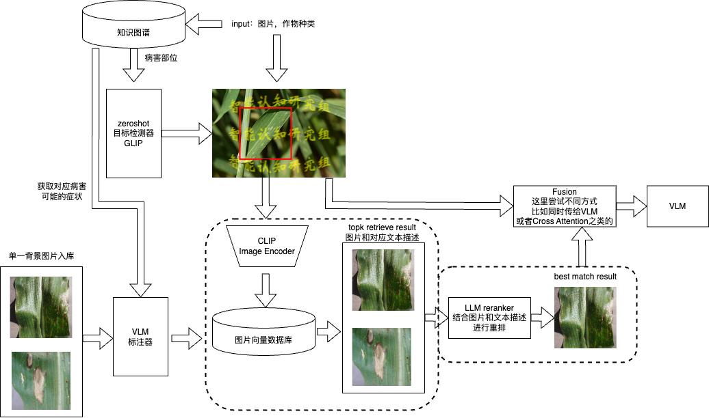

# AgriVLM-RAG

一个可以不微调VLM，即插即用的图像RAG模块，增强通用VLM在病虫害识别和农业问答领域的能力：

- 可以通过API调用GPT-4o作为reranker。

- TODO：也可以在本地对minicpm等模型进行微调以实现全过程能够本地化。
## Architecture



目录结构
```
agrirag
  ├── clip 用于抽取图像和文本特征
  ├── database 基于faiss的向量数据库
  ├── detector 调用用于锁定病害部位的目标检测器
  └── reranker 在相似度检索后进行细粒度重排的排序器
make_db.py 用于构建向量数据库
make_dataset
  ├── images_data.json 基础数据集
  ├── images_description_data.json 图片描述数据集
  ├── call_gpt.py 输入消息队列调用VLM，返回消息
  └── get_label.ipynb 结合图谱的病害症状，通过GPT-4o生成图片描述
```

## Requirements

## 日志
- 24.08.23 发现没有上传图床的必要，GPT4o支持base64上传图片
  - openai文档：https://platform.openai.com/docs/guides/vision/uploading-base-64-encoded-images